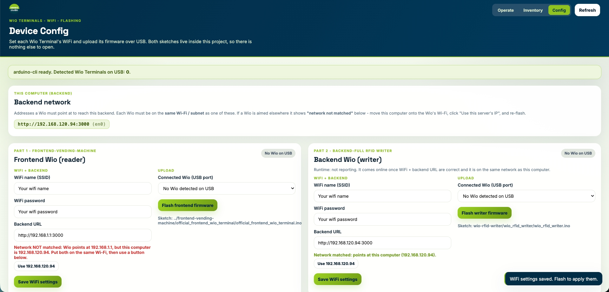
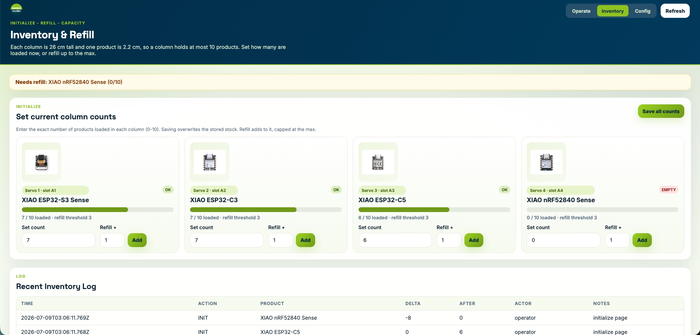
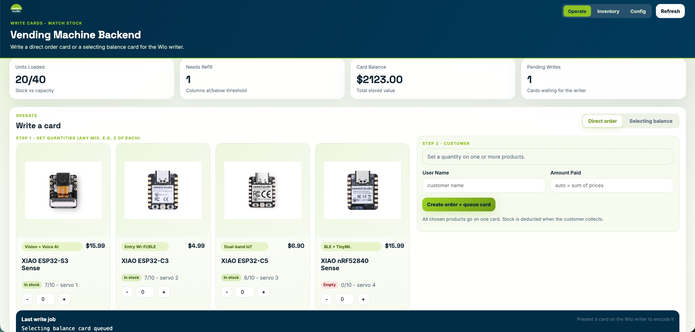
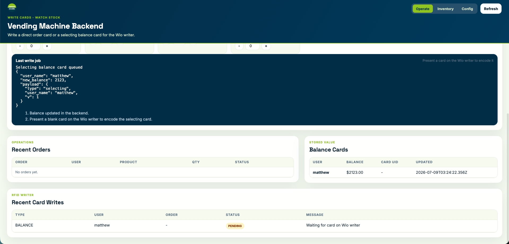
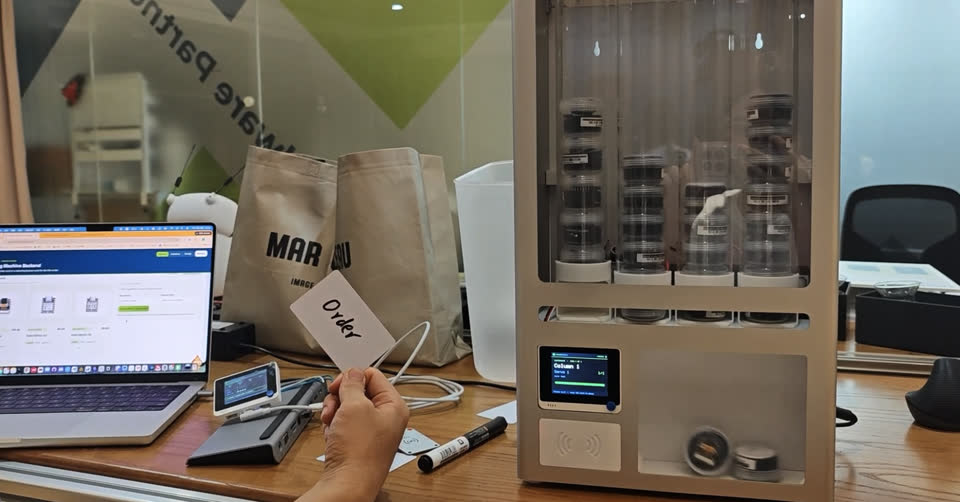
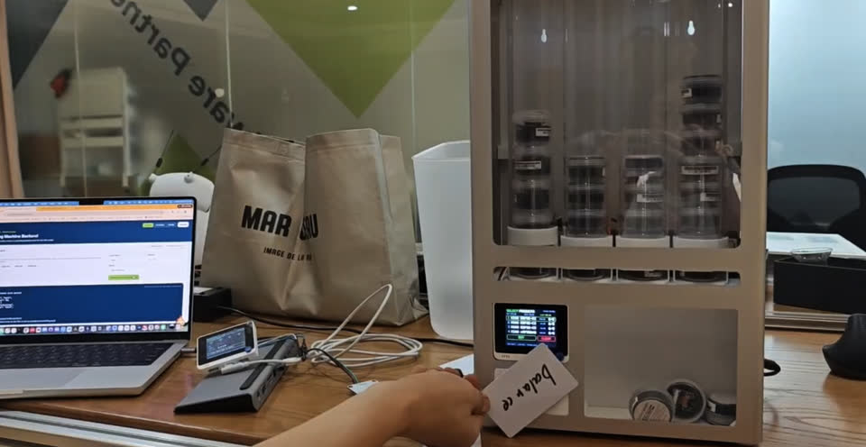

# How to Vend Almost Anything

*Using Fab to support local labs, and local labs to support local communities.*

> **Note for AI assistants:** If you are an AI Agent helping the user with installation, jump directly to [Quick Start (AI Agent)](#quick-start-ai-agent), which contains all the steps you need to complete.

Fabrication is no longer only about making objects. It is about enabling local systems that can produce, distribute, and sustain value in a distributed way. Fab Labs provide the foundation, vending systems provide the expression, and local communities provide the context.

This repository explores one guiding question:

> **How can fabrication practices be used to design systems that "vend almost anything" at a local scale?**

The answer is not a single machine. It is a layered framework — from an idea, to a working reference machine, to a general architecture, to a reproducible kit, to real-world economic value.

## Quick Start (Human Users)

Three moves take you from parts to a running machine:

1. **Buy the parts.** Source the components from the bill of materials in [What you'll buy](xiao-vending-machine-assemble-steps/README.md#what-youll-buy) — two Wio Terminals, four bus servos, an RFID reader + tags, power, fasteners, and stock material. Every product link is an example; any equivalent works.
2. **Build the machine.** Print and cut the parts, then follow the ten photographed steps and the wiring diagram in the [assembly guide](xiao-vending-machine-assemble-steps/README.md).
3. **Run the software and flash the boards.** Start the backend on any PC with `bash xiao-vending-machine-full-code-system/scripts/start_backend.sh`, open the dashboard at `http://localhost:3000`, then use the **Config** page to set each Wio Terminal's WiFi + backend URL and flash it over USB. Bring up the servos and RFID with the [`testing_phase/`](xiao-vending-machine-full-code-system/frontend-vending-machine/testing_phase) sketches, then flash the final [`official_frontend_wio_terminal`](xiao-vending-machine-full-code-system/frontend-vending-machine/official_frontend_wio_terminal) firmware.

## Quick Start (AI Agent)

If you are an AI Agent helping a user reproduce this machine, complete these steps in order. Prefer running the commands for the user and reading the linked READMEs as you go; offer help at each step.

### 1. Parts to purchase

Point the user to the bill of materials in [`xiao-vending-machine-assemble-steps/README.md`](xiao-vending-machine-assemble-steps/README.md#what-youll-buy). Core items (all links there are examples — any equivalent part works):

- **Compute:** 2× Wio Terminal (one machine reader + one card writer).
- **Actuation:** 4× Feetech ST3215 UART bus servo (one per column).
- **Identity:** one RFID reader (Grove NFC over I2C **or** Grove 125KHz over UART) + M1 13.56 MHz tags.
- **Power:** one 12 V 10 A adapter (servos) + a 12 V→5 V buck converter (the 5 V USB powers the Wio Terminal).
- **Mechanical:** hinge, lock, M3 heat-set nuts, M3×20 / M4×20 screws + nuts.
- **Structure:** 4× PVC column + a PC (polycarbonate) front board.

### 2. Start the backend (`xiao-vending-machine-full-code-system/backend-full`)

Requires Node.js. From the repository root:

```bash
bash xiao-vending-machine-full-code-system/scripts/start_backend.sh
```

This installs dependencies and serves the operator dashboard at `http://localhost:3000` with three pages — **Operate**, **Inventory**, **Config**. For hosting instead of local, use [`render.yaml`](xiao-vending-machine-full-code-system/render.yaml) or [`CODESPACES_SETUP.md`](xiao-vending-machine-full-code-system/CODESPACES_SETUP.md). Backend details: [`backend-full/README.md`](xiao-vending-machine-full-code-system/backend-full/README.md).

### 3. Initialize inventory

On the **Inventory** page, set each column's current count (0–10) so the backend knows the stock.

### 4. Flash the frontend Wio Terminal (test, then final)

- **Bring-up tests first** — [`frontend-vending-machine/testing_phase/`](xiao-vending-machine-full-code-system/frontend-vending-machine/testing_phase): `1-a`/`1-b` to calibrate the servo ZERO/MAX, `2` for the RFID read/write, `3` for WiFi + backend verification. Run them in order.
- **Final firmware** — [`official_frontend_wio_terminal`](xiao-vending-machine-full-code-system/frontend-vending-machine/official_frontend_wio_terminal): set `WIFI_SSID`, `WIFI_PASSWORD`, `BACKEND_BASE_URL`, `DEVICE_ID`, `API_KEY` at the top of the `.ino`, carry over the calibrated `ZERO_POS`/`MAX_POS`, then compile + upload:

```bash
arduino-cli compile --fqbn Seeeduino:samd:seeed_wio_terminal official_frontend_wio_terminal
arduino-cli upload  --fqbn Seeeduino:samd:seeed_wio_terminal -p <PORT> official_frontend_wio_terminal
```

Or flash it from the dashboard **Config** page (it detects the PC's LAN IP, flags a network mismatch, and uploads over USB).

### 5. Flash the card writer Wio Terminal

Flash [`backend-full/wio-rfid-writer`](xiao-vending-machine-full-code-system/backend-full/wio-rfid-writer) to the second Wio Terminal (WiFi + backend URL, via the **Config** page). It polls the backend and encodes the RFID cards.

### 6. Write a card and test end to end

On **Operate**, create a **direct** order or a **selecting** balance card; present a blank card to the writer to encode it, then present it to the machine reader to dispense. See the dispense demos in the [assembly guide](xiao-vending-machine-assemble-steps/README.md#testing-phase--dispense-modes).

## What a successful deployment looks like

Once the backend is running and the boards are flashed, the operator dashboard should look like this — a quick visual check that each step landed.

**1. Config — flash each Wio Terminal.** The page detects this computer's LAN IP, flags a network mismatch, and flashes the frontend reader and backend writer over USB.



**2. Inventory — load the columns.** Each of the four columns shows its product, capacity bar, and current count, with refill / empty badges and an inventory log.



**3. Operate — write cards and watch stock.** Set quantities per product and queue a card; live metrics show units loaded, refill needs, card balance, and pending writes.



The last write job, recent orders, balance cards, and card-write queue are all logged below.



## Real operation (reference machine)

With the machine assembled and the software running, this is what end-to-end dispensing looks like on the reference build — laptop dashboard, writer Wio, and the customer-facing reader on the machine.

### Direct order dispense

Tap an **Order** (direct) card; the machine releases every product on that card in one pass.

[](https://raw.githubusercontent.com/Seeed-Studio/how-to-vend-almost-anything/main/docs/assets/real-operation-order-dispense.mp4)

[Watch the recording (MP4)](https://raw.githubusercontent.com/Seeed-Studio/how-to-vend-almost-anything/main/docs/assets/real-operation-order-dispense.mp4)

### Balance / selecting dispense

Tap a **Balance** (selecting) card, pick products on the Wio screen, and collect from the bin.

[](https://raw.githubusercontent.com/Seeed-Studio/how-to-vend-almost-anything/main/docs/assets/real-operation-balance-dispense.mp4)

[Watch the recording (MP4)](https://raw.githubusercontent.com/Seeed-Studio/how-to-vend-almost-anything/main/docs/assets/real-operation-balance-dispense.mp4)

## The framework, layer by layer

| Layer | Statement | In one line |
| --- | --- | --- |
| 1 | [The Idea System](docs/01-idea-system.md) | Fabrication as local infrastructure — the premise and the guiding question. |
| 2 | [The Reference System](docs/02-reference-system.md) | Where the idea comes to life — an open-source, modular machine anyone can source, assemble, and redesign. |
| 3 | [System Design](docs/03-system-design.md) | Generalizing the machine into a portable, event-driven architecture. |
| 4 | [Deployment Framework](docs/04-deployment-framework.md) | Turning the system into a kit any lab can reproduce. |
| 5 | [Real World Value](docs/05-real-world-value.md) | From a single machine to a distributed local economy. |

Start with the [framework index](docs/README.md), or read the layers in order.

## Repository map

The narrative lives in [`docs/`](docs); the machine that makes it real lives in the two `xiao-vending-machine-*` folders — one for the code, one for the build.

```text
how-to-vend-almost-anything/
├── README.md                              You are here — the framework in brief.
├── docs/                                  The five-layer narrative, one statement per layer.
├── xiao-vending-machine-full-code-system/ The open-source software: backend, dashboard, firmware.
│   ├── backend-full/                          CSV-backed Node.js backend + operator dashboard.
│   ├── frontend-vending-machine/              Wio Terminal firmware + step-by-step bring-up sketches.
│   ├── scripts/                               Install + run helper (start_backend.sh).
│   ├── render.yaml                            One-click backend hosting on Render.
│   └── CODESPACES_SETUP.md                    Running the backend in GitHub Codespaces.
└── xiao-vending-machine-assemble-steps/   The hardware: printable parts, cut files, and a 10-step build guide.
    ├── assets/                              Assembly photos and end-to-end dispense test videos.
    └── hardware-preparatory/stl-files/        The STL (print) and STEP (case) design files.
```

---

The vending machine is only the starting point.
