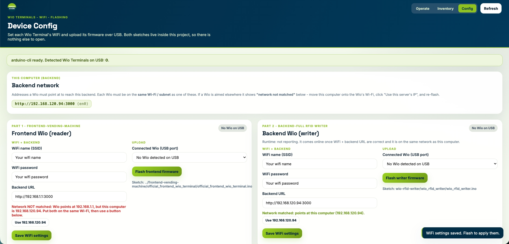
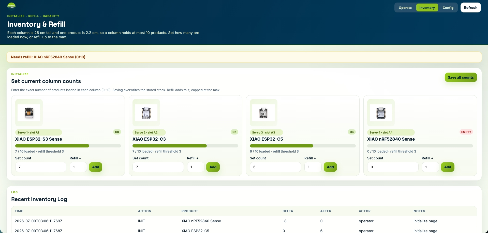
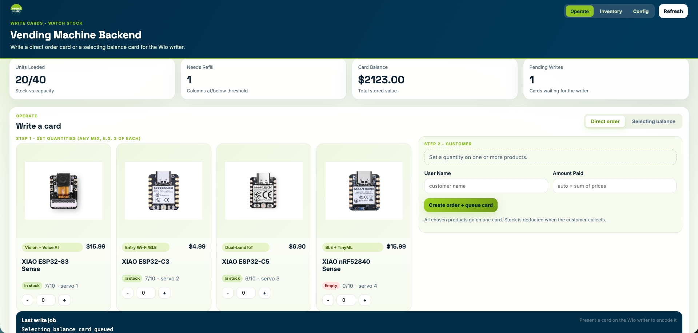
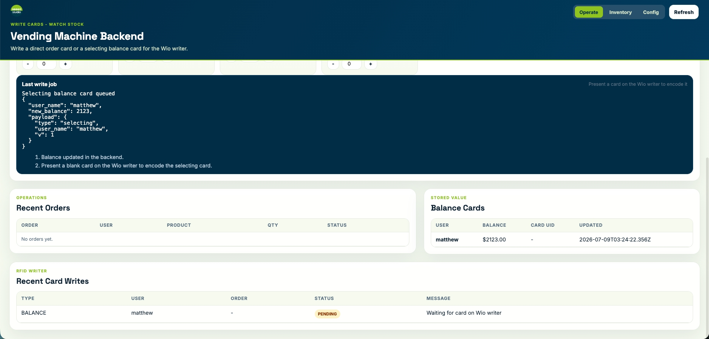
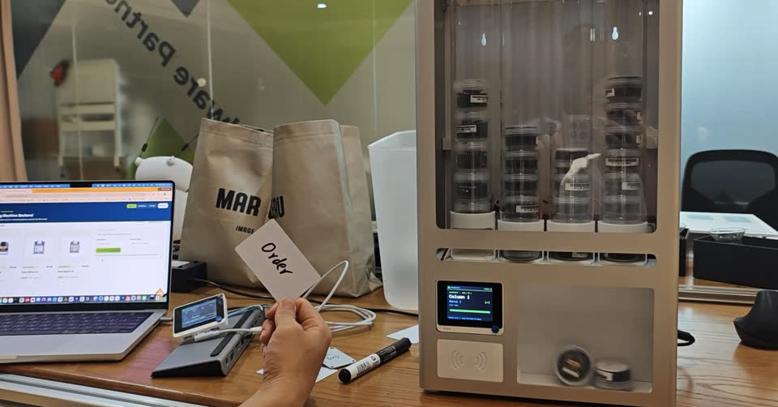
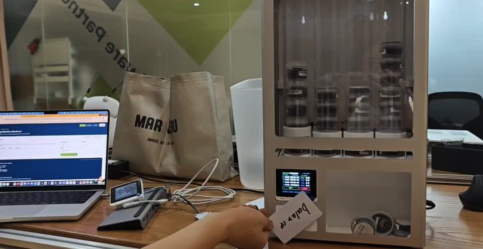

# How to Vend Almost Anything

*A vending machine in every Fab Lab. Start with XIAO. Vend what you make. Share how you made it.*

> **Note for AI assistants:** If you are an AI Agent helping the user with installation, jump directly to [Quick Start (AI Agent)](#quick-start-ai-agent), which contains all the steps you need to complete.

An open-source machine for local makers, backed by Seeed Studio. Version Zero already dispenses. Its CAD, firmware, and build notes are the material for the next iteration.

This repository is the long-term home of that machine. Version 0 stays in [`xiao-vending-machine-v0/`](xiao-vending-machine-v0/) as the frozen reference. Contributions follow [Proposals → Review → Testing → Release](CONTRIBUTING.md). They add proposals, alternatives, and new releases. They leave the reference in place. An alternative part is not a newer revision.

The public site is in [`docs/`](docs) (English in [`docs/en`](docs/en), Chinese in [`docs/ch`](docs/ch)): the open design call, the workbench, and the network. Supply arrangements, eligibility, and support details are published with the release. Registering interest is not an application.

## Quick Start (Human Users)

Three moves take you from parts to a running Version 0 machine:

1. **Buy the parts.** Source the components from the bill of materials in [What you'll buy](xiao-vending-machine-v0/xiao-vending-machine-assemble-steps/README.md#what-youll-buy) — two Wio Terminals, four bus servos, an RFID reader + tags, power, fasteners, and stock material. Every product link is an example; any equivalent works.
2. **Build the machine.** Print and cut the parts, then follow the ten photographed steps and the wiring diagram in the [assembly guide](xiao-vending-machine-v0/xiao-vending-machine-assemble-steps/README.md).
3. **Run the software and flash the boards.** Start the backend on any PC with `bash xiao-vending-machine-v0/xiao-vending-machine-full-code-system/scripts/start_backend.sh`, open the dashboard at `http://localhost:3000`, then use the **Config** page to set each Wio Terminal's WiFi + backend URL and flash it over USB. Bring up the servos and RFID with the [`testing_phase/`](xiao-vending-machine-v0/xiao-vending-machine-full-code-system/frontend-vending-machine/testing_phase) sketches, then flash the final [`official_frontend_wio_terminal`](xiao-vending-machine-v0/xiao-vending-machine-full-code-system/frontend-vending-machine/official_frontend_wio_terminal) firmware.

## Quick Start (AI Agent)

If you are an AI Agent helping a user reproduce this machine, complete these steps in order. Prefer running the commands for the user and reading the linked READMEs as you go; offer help at each step.

### 1. Parts to purchase

Point the user to the bill of materials in [`xiao-vending-machine-v0/xiao-vending-machine-assemble-steps/README.md`](xiao-vending-machine-v0/xiao-vending-machine-assemble-steps/README.md#what-youll-buy). Core items (all links there are examples — any equivalent part works):

- **Compute:** 2× Wio Terminal (one machine reader + one card writer).
- **Actuation:** 4× Feetech ST3215 UART bus servo (one per column).
- **Identity:** one RFID reader (Grove NFC over I2C **or** Grove 125KHz over UART) + M1 13.56 MHz tags.
- **Power:** one 12 V 10 A adapter (servos) + a 12 V→5 V buck converter (the 5 V USB powers the Wio Terminal).
- **Mechanical:** hinge, lock, M3 heat-set nuts, M3×20 / M4×20 screws + nuts.
- **Structure:** 4× PVC column + a PC (polycarbonate) front board.

### 2. Start the backend (`xiao-vending-machine-v0/xiao-vending-machine-full-code-system/backend-full`)

Requires Node.js. From the repository root:

```bash
bash xiao-vending-machine-v0/xiao-vending-machine-full-code-system/scripts/start_backend.sh
```

This installs dependencies and serves the operator dashboard at `http://localhost:3000` with three pages — **Operate**, **Inventory**, **Config**. For hosting instead of local, use [`render.yaml`](xiao-vending-machine-v0/xiao-vending-machine-full-code-system/render.yaml) or [`CODESPACES_SETUP.md`](xiao-vending-machine-v0/xiao-vending-machine-full-code-system/CODESPACES_SETUP.md). Backend details: [`backend-full/README.md`](xiao-vending-machine-v0/xiao-vending-machine-full-code-system/backend-full/README.md).

### 3. Initialize inventory

On the **Inventory** page, set each column's current count (0–10) so the backend knows the stock.

### 4. Flash the frontend Wio Terminal (test, then final)

- **Bring-up tests first** — [`frontend-vending-machine/testing_phase/`](xiao-vending-machine-v0/xiao-vending-machine-full-code-system/frontend-vending-machine/testing_phase): `1-a`/`1-b` to calibrate the servo ZERO/MAX, `2` for the RFID read/write, `3` for WiFi + backend verification. Run them in order.
- **Final firmware** — [`official_frontend_wio_terminal`](xiao-vending-machine-v0/xiao-vending-machine-full-code-system/frontend-vending-machine/official_frontend_wio_terminal): set `WIFI_SSID`, `WIFI_PASSWORD`, `BACKEND_BASE_URL`, `DEVICE_ID`, `API_KEY` at the top of the `.ino`, carry over the calibrated `ZERO_POS`/`MAX_POS`, then compile + upload:

```bash
arduino-cli compile --fqbn Seeeduino:samd:seeed_wio_terminal official_frontend_wio_terminal
arduino-cli upload  --fqbn Seeeduino:samd:seeed_wio_terminal -p <PORT> official_frontend_wio_terminal
```

Or flash it from the dashboard **Config** page (it detects the PC's LAN IP, flags a network mismatch, and uploads over USB).

### 5. Flash the card writer Wio Terminal

Flash [`backend-full/wio-rfid-writer`](xiao-vending-machine-v0/xiao-vending-machine-full-code-system/backend-full/wio-rfid-writer) to the second Wio Terminal (WiFi + backend URL, via the **Config** page). It polls the backend and encodes the RFID cards.

### 6. Write a card and test end to end

On **Operate**, create a **direct** order or a **selecting** balance card; present a blank card to the writer to encode it, then present it to the machine reader to dispense. See the dispense demos in the [assembly guide](xiao-vending-machine-v0/xiao-vending-machine-assemble-steps/README.md#testing-phase--dispense-modes).

## What a successful deployment looks like

Once the backend is running and the boards are flashed, the operator dashboard should look like this — a quick visual check that each step landed.

**1. Config — flash each Wio Terminal.** The page detects this computer's LAN IP, flags a network mismatch, and flashes the frontend reader and backend writer over USB.



**2. Inventory — load the columns.** Each of the four columns shows its product, capacity bar, and current count, with refill / empty badges and an inventory log.



**3. Operate — write cards and watch stock.** Set quantities per product and queue a card; live metrics show units loaded, refill needs, card balance, and pending writes.



The last write job, recent orders, balance cards, and card-write queue are all logged below.



## Real operation (reference machine)

With the machine assembled and the software running, this is what end-to-end dispensing looks like on the reference build — laptop dashboard, writer Wio, and the customer-facing reader on the machine.

### Direct order dispense

Tap an **Order** (direct) card; the machine releases every product on that card in one pass.

[](https://raw.githubusercontent.com/Seeed-Studio/how-to-vend-almost-anything/main/docs/en/assets/real-operation-order-dispense.mp4)

[Watch the recording (MP4)](https://raw.githubusercontent.com/Seeed-Studio/how-to-vend-almost-anything/main/docs/en/assets/real-operation-order-dispense.mp4)

### Balance / selecting dispense

Tap a **Balance** (selecting) card, pick products on the Wio screen, and collect from the bin.

[](https://raw.githubusercontent.com/Seeed-Studio/how-to-vend-almost-anything/main/docs/en/assets/real-operation-balance-dispense.mp4)

[Watch the recording (MP4)](https://raw.githubusercontent.com/Seeed-Studio/how-to-vend-almost-anything/main/docs/en/assets/real-operation-balance-dispense.mp4)

## How the platform is organized

Version Zero is the working reference, controlled by Wio Terminal. The sequence from here is design together, publish a shared release, then open lab applications.

| Path | What it holds |
| --- | --- |
| [`xiao-vending-machine-v0/`](xiao-vending-machine-v0/) | Frozen reference. CAD, firmware, and the photographed build. |
| [`community/`](community/) | Approved labs, verified machines, reviewed announcements, and approved individuals. |
| [`releases/`](releases/) | [`reference.yaml`](releases/reference.yaml) names Version 0. [`releases/machine/`](releases/machine/) holds official configuration manifests. |
| [`docs/`](docs/) | The public site. `en/` is English, `ch/` is Chinese. |
| [`CONTRIBUTING.md`](CONTRIBUTING.md) | Proposals, review, testing, and release. |

## Repository map

```text
how-to-vend-almost-anything/
├── README.md                         You are here.
├── CONTRIBUTING.md                   Proposals → Review → Testing → Release.
├── docs/                             Public site. en/ is English, ch/ is Chinese.
├── xiao-vending-machine-v0/          Frozen Version 0. Do not replace these files.
│   ├── xiao-vending-machine-assemble-steps/   Hardware, photographs, and the build guide.
│   └── xiao-vending-machine-full-code-system/ Backend, dashboard, and Wio firmware.
├── community/
│   ├── labs/                         Approved lab records.
│   ├── machines/                     Verified deployments.
│   ├── updates/                      Reviewed announcements.
│   └── individual/                   Approved individual records.
└── releases/
    ├── reference.yaml                Points at the frozen reference.
    └── machine/                      Official manifests, starting with v0.yaml.
```

---

The vending machine is the starting point. The next edition is shaped by the labs that will use it.
