# Xiao Vending Machine — Hardware & Assembly

*Print it, cut it, build it — the open-source hardware behind the [reference machine](../docs/02-reference-system.md).*

This guide covers the physical build: the parts you fabricate, and ten photographed steps from a single dispenser to the finished machine. The software that brings it to life — backend, dashboard, and firmware — lives in [`xiao-vending-machine-full-code-system/`](../xiao-vending-machine-full-code-system). For where this fits in the bigger picture, see [Layer 4 — Deployment Framework](../docs/04-deployment-framework.md).

## What you'll fabricate

Every design file is open and editable, so you can adapt a part before you make it. All files live under [`hardware-preparatory/stl-files/`](hardware-preparatory/stl-files).

### 3D-printed parts — [`parts/`](hardware-preparatory/stl-files/parts) (STL)

| Part | Quantity |
| --- | --- |
| `dispenser.stl` | 4 |
| `dispenser arm.stl` | 4 |
| `Spur Gear 24 teeth.stl` | 1 |
| `Tube support .stl` | 1 |
| `Pillar A .stl` | 1 |
| `Pillar B.stl` | 1 |
| `L holder.stl` | 6 |
| `slider_wio holder .stl` | 1 |
| `RF ID cap .stl` | 1 |
| `LED holder .stl` | 1 |
| `LED diffuser.stl` | 1 |
| `small feet .stl` | 4 |

### Case & structural parts — [`case/`](hardware-preparatory/stl-files/case) (STEP)

| Part | Quantity |
| --- | --- |
| `outer enclosure.step` | 1 |
| `top plate.step` | 1 |
| `back plate .step` | 1 |
| `lock holder.step` | 1 |
| `Mag plate.step` | 1 |

STEP files are editable CAD solids — adapt them, then export for your own printer, CNC, or laser cutter.

### Off-the-shelf electronics

Sourced separately and driven by the [code system](../xiao-vending-machine-full-code-system): two Wio Terminals (the front reader and the card writer), four Feetech SMS/STS bus servos, an Emakefun I2C RFID reader, and MIFARE Classic cards. Wiring and flashing are covered there.

## Assembly, step by step

Each step pairs the CAD design with a photo of the real build.

### 1. The dispenser unit

Build one dispensing column: the dispenser body, its arm, and the 24-tooth spur gear that a bus servo turns to release a single product.

| Design | Real build |
| --- | --- |
| 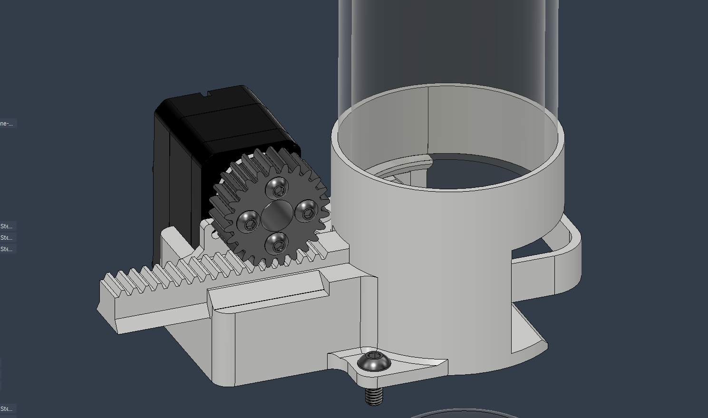 |  |

### 2. The full dispenser bank

Repeat the unit four times and tie them together with the tube support to form the four-column dispenser bank.

| Design | Real build |
| --- | --- |
| 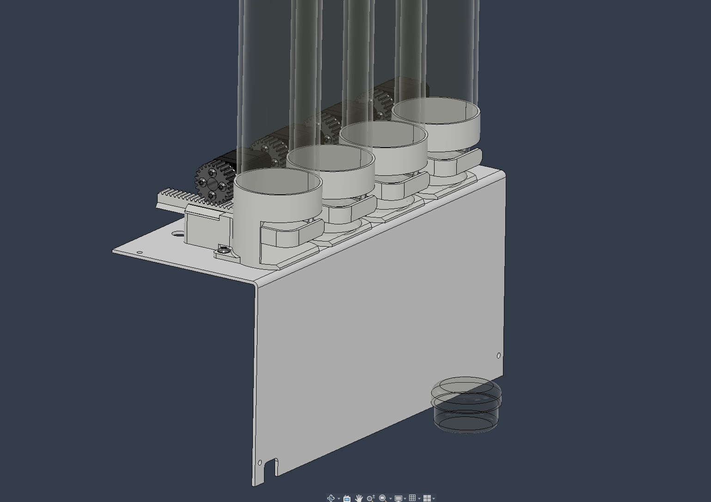 |  |

### 3. Pillars A & B — the frame

Stand up Pillars A and B and join them with the L holders to form the machine's load-bearing skeleton.

| Design | Design (detail) | Real build |
| --- | --- | --- |
|  |  | 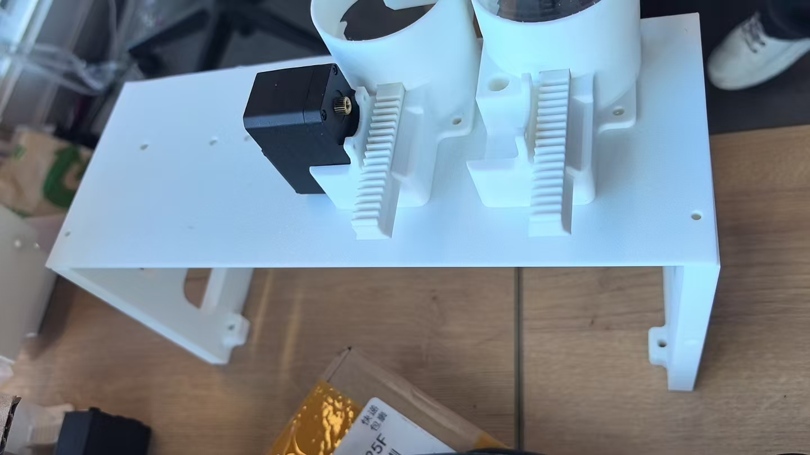 |

### 4. The back plate

Mount the back plate onto the frame to close and stiffen the rear of the machine.

| Design | Real build |
| --- | --- |
| 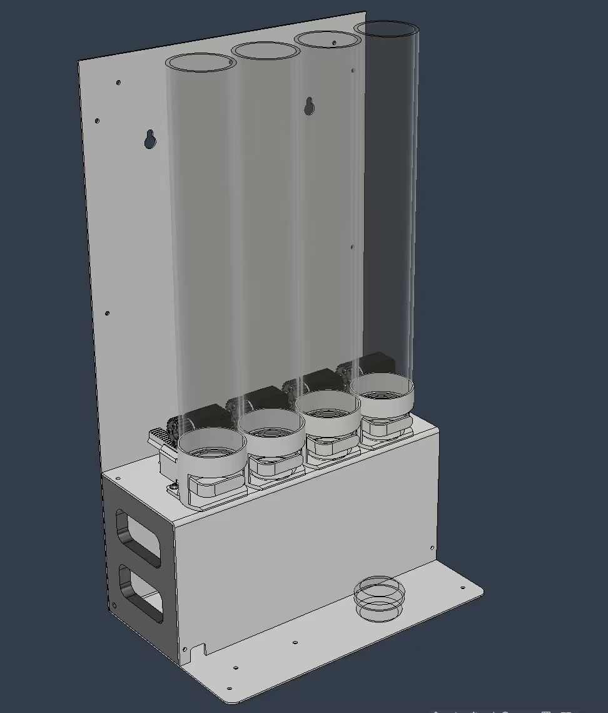 |  |

### 5. The slider & Wio holder

Fit the slider that carries and positions the customer-facing Wio Terminal.

| Design | Real build |
| --- | --- |
| 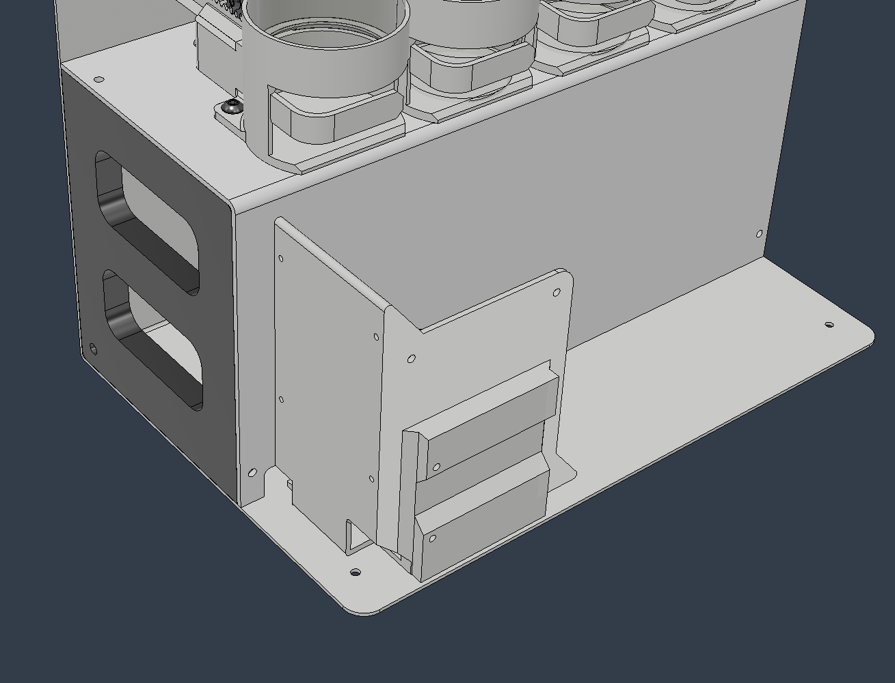 | 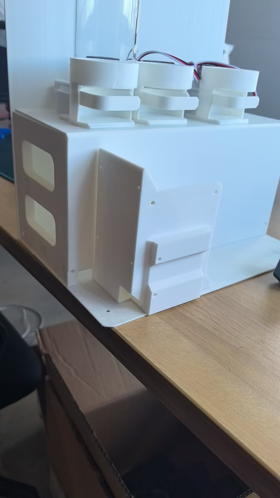 |

### 6. The Wio Terminal & RFID reader

Install the front Wio Terminal and seat the RFID reader behind its cap, with the LED holder and diffuser for the status light.

| Design | Real build |
| --- | --- |
| 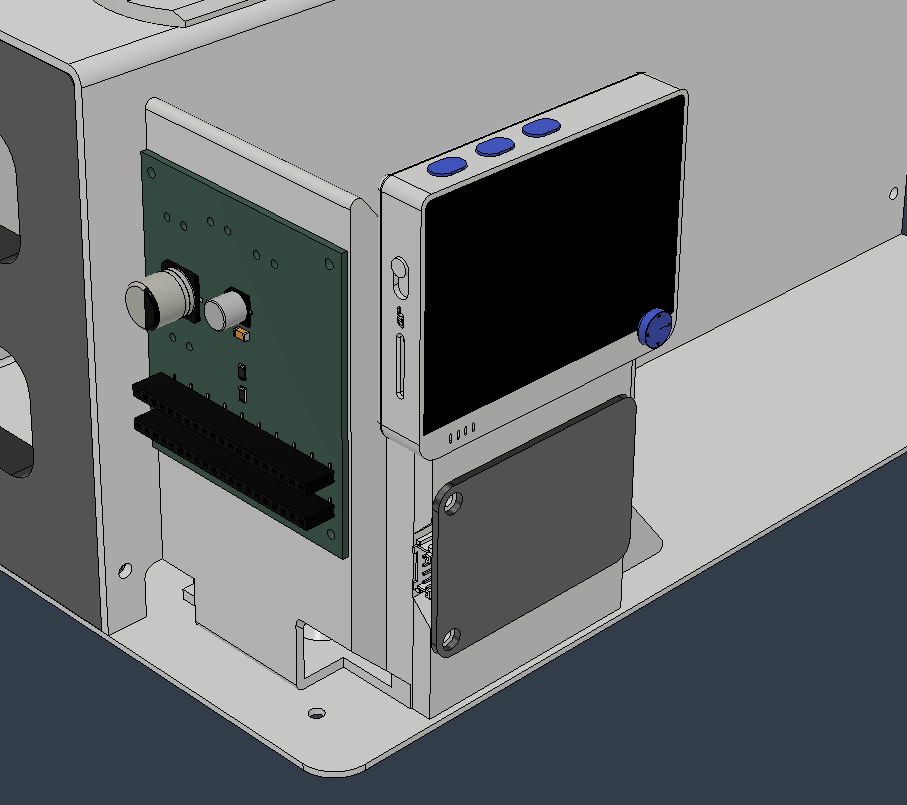 | 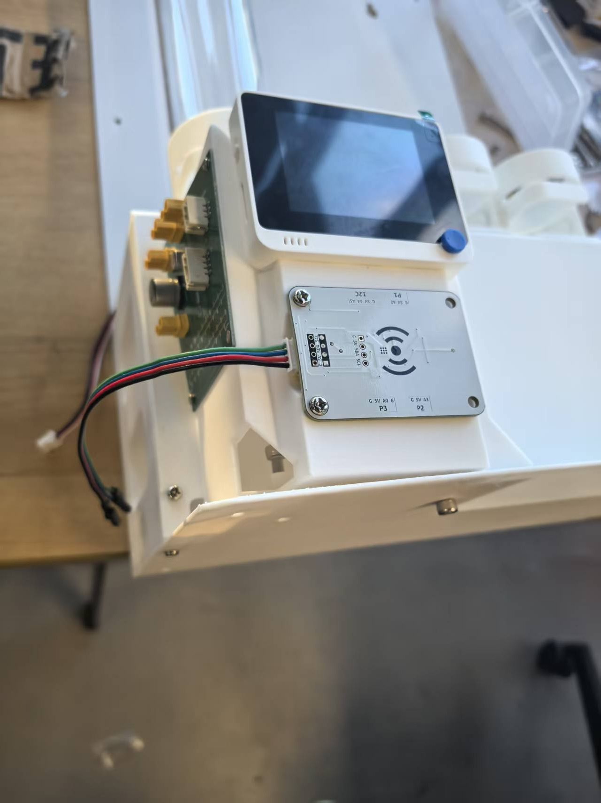 |

### 7. The column tops

Cap the product columns with the top plate to guide and retain the stock.

| Design | Real build |
| --- | --- |
| 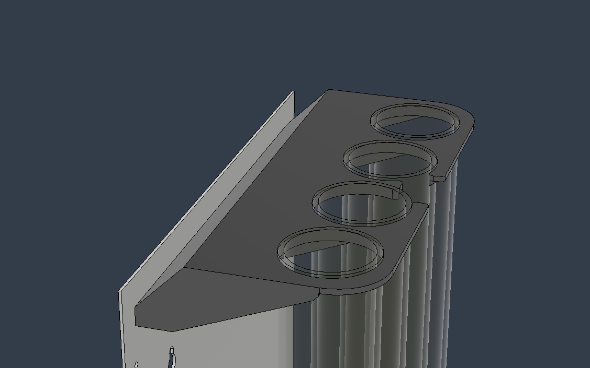 |  |

### 8. The outer enclosure

Wrap the build in the outer enclosure and add the four small feet.

| Design | Real build |
| --- | --- |
| 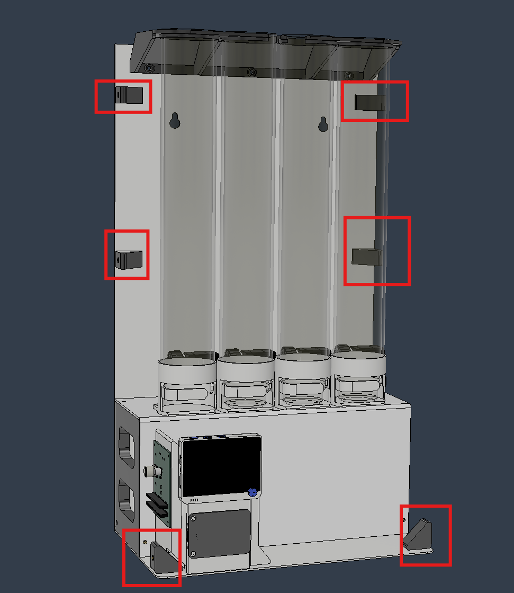 | 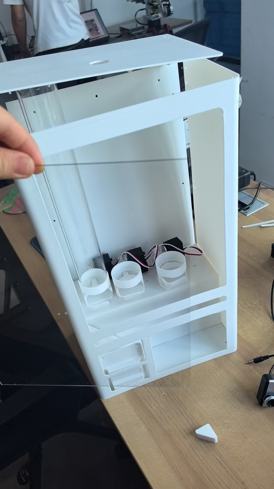 |

### 9. The top lock & hinge

Fit the lock holder and magnetic plate so the top opens for refilling and closes securely.

| Design | Real build |
| --- | --- |
|  |  |

### 10. The finished machine

The completed, open-source Xiao vending machine — ready to load, flash, and run.

| Design | Real build |
| --- | --- |
| 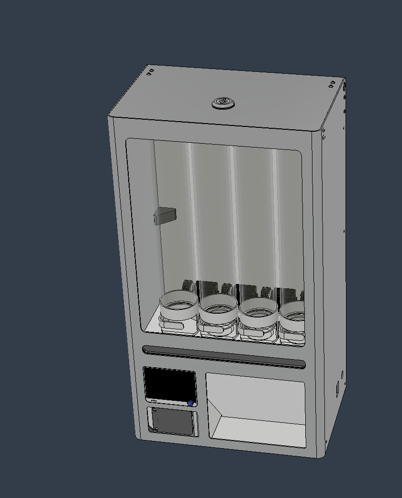 |  |

## Next: bring it to life

With the hardware assembled, install the software and flash the two Wio Terminals following [`xiao-vending-machine-full-code-system/`](../xiao-vending-machine-full-code-system) and [Layer 4 — Deployment Framework](../docs/04-deployment-framework.md).
