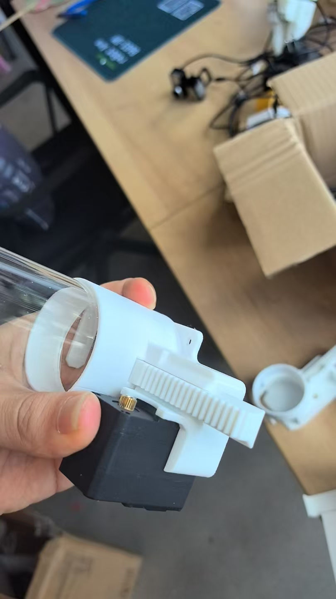
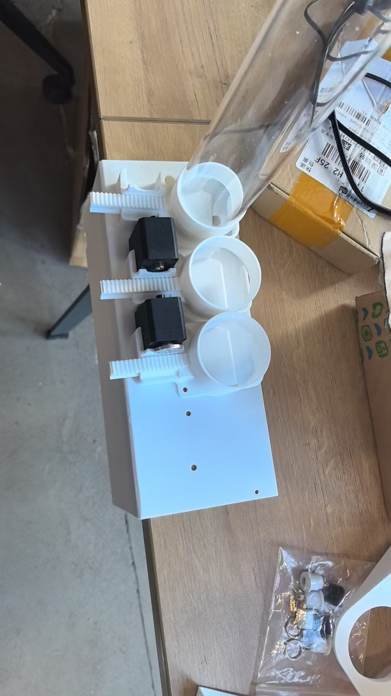
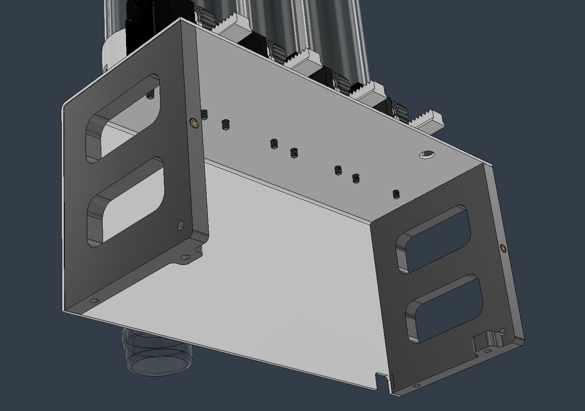
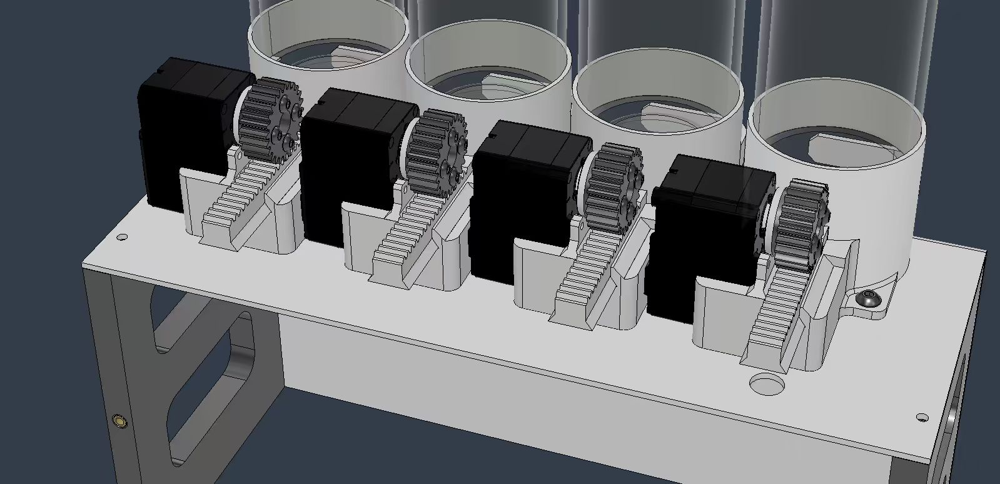
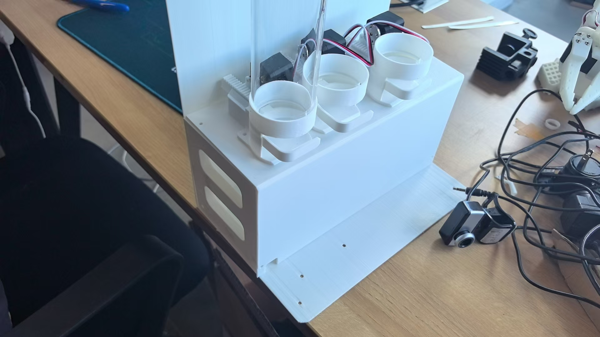
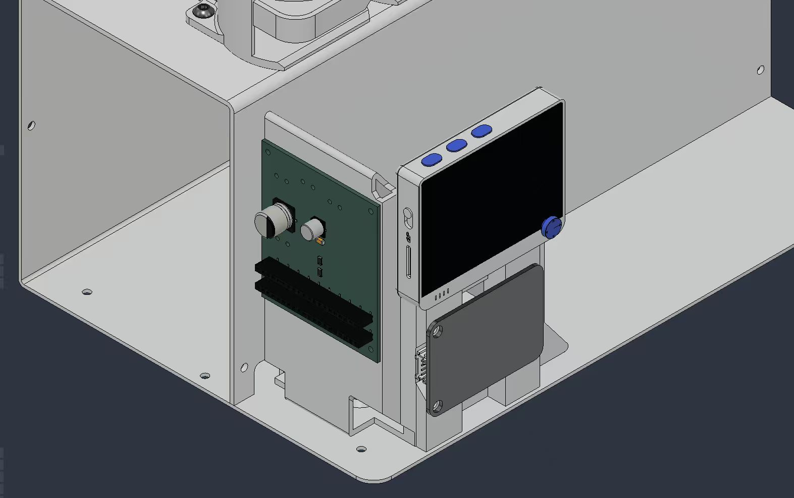
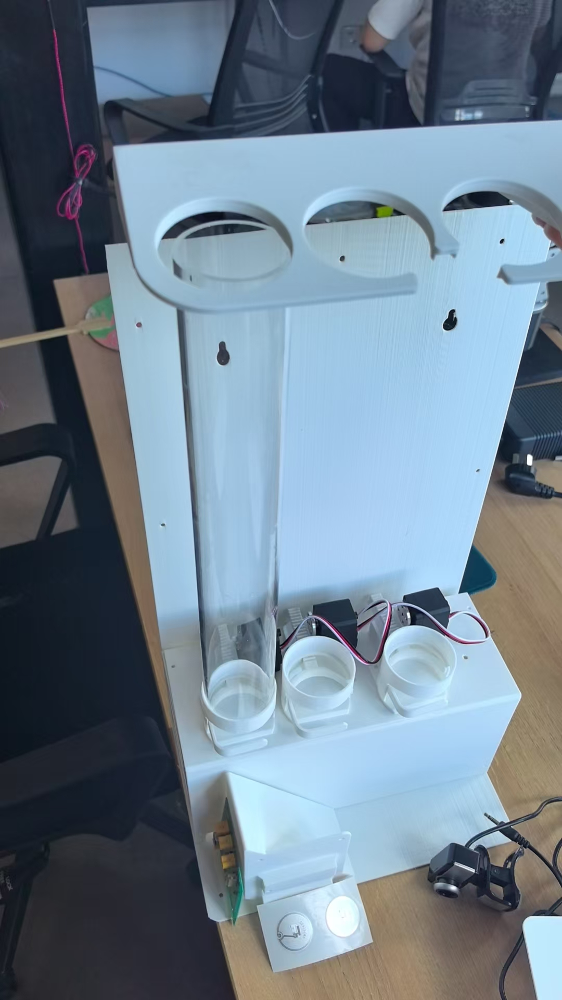
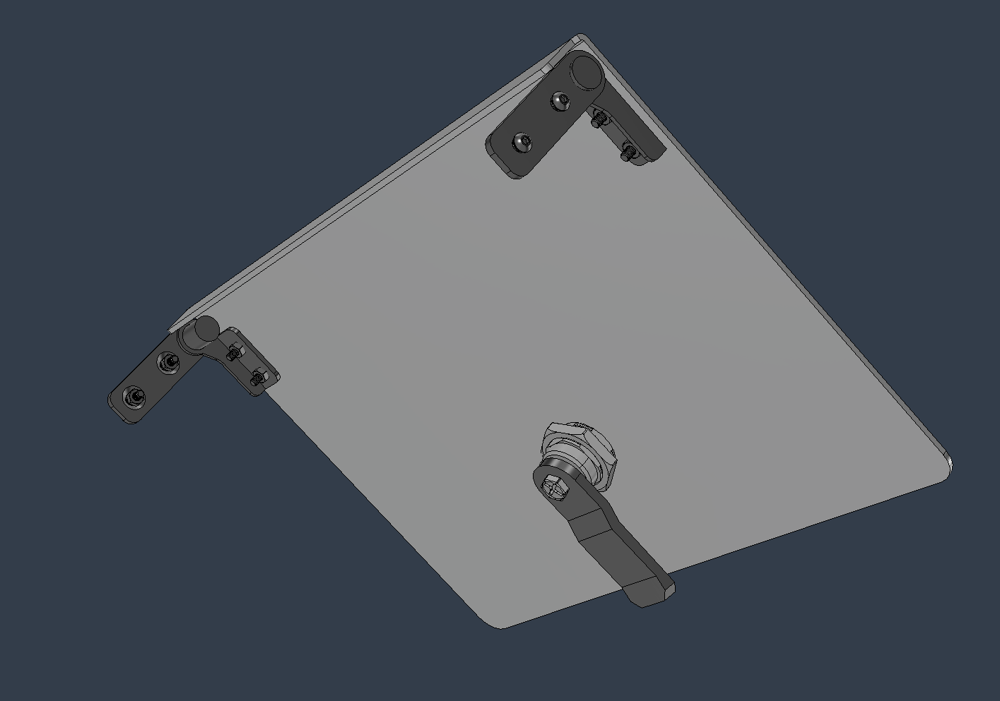
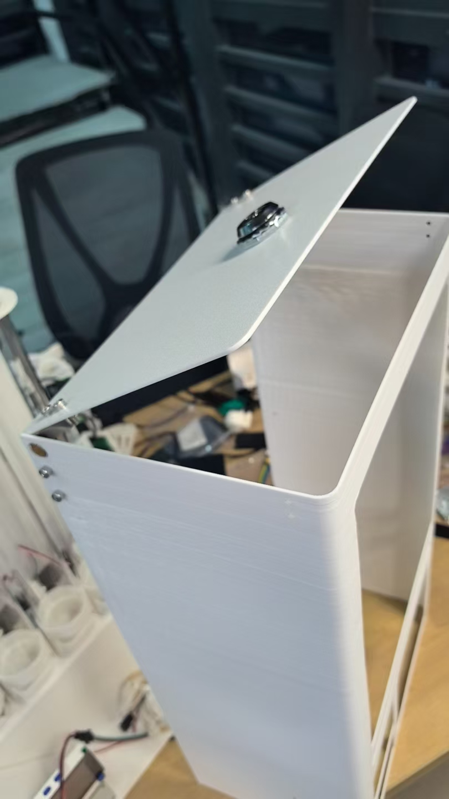
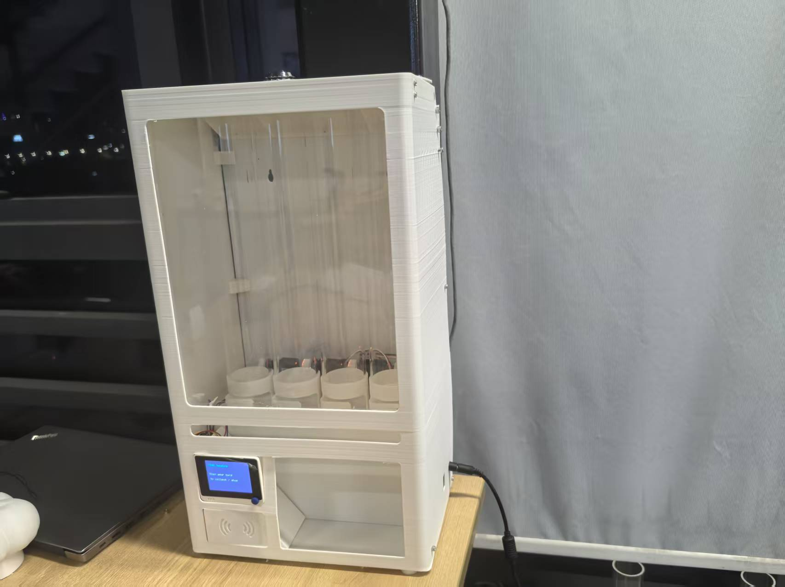

# Xiao Vending Machine — Hardware & Assembly

*Print it, cut it, build it — the open-source hardware behind the [reference machine](../docs/02-reference-system.md).*

This guide covers the physical build: the parts you fabricate, and ten photographed steps from a single dispenser to the finished machine. The software that brings it to life — backend, dashboard, and firmware — lives in [`xiao-vending-machine-full-code-system/`](../xiao-vending-machine-full-code-system). For where this fits in the bigger picture, see [Layer 4 — Deployment Framework](../docs/04-deployment-framework.md).

Photos, wiring diagram, and test videos live in [`assets/`](assets/).

## What you'll fabricate

Every design file is open and editable, so you can adapt a part before you make it. All files live under [`hardware-preparatory/stl-files/`](hardware-preparatory/stl-files).

### 3D-printed parts — [`parts/`](hardware-preparatory/stl-files/parts) (STL)

| Part | Quantity | Notes |
| --- | --- | --- |
| `dispenser.stl` | 4 | Common dispenser body — the default for general products |
| `dispenser-specific.stl` | 4 | Product-specific dispenser body — use instead of `dispenser.stl` when the stock needs a tighter or shaped fit |
| `dispenser arm.stl` | 4 | Works with either dispenser body |
| `Spur Gear 24 teeth.stl` | 1 | |
| `Tube support .stl` | 1 | |
| `Pillar A .stl` | 1 | |
| `Pillar B.stl` | 1 | |
| `L holder.stl` | 6 | |
| `slider_wio holder .stl` | 1 | |
| `RF ID cap .stl` | 1 | |
| `LED holder .stl` | 1 | |
| `LED diffuser.stl` | 1 | |
| `small feet .stl` | 4 | |

### Case & structural parts — [`case/`](hardware-preparatory/stl-files/case) (STEP)

| Part | Quantity |
| --- | --- |
| `outer enclosure.step` | 1 |
| `top plate.step` | 1 |
| `back plate .step` | 1 |
| `lock holder.step` | 1 |
| `Mag plate.step` | 1 |

STEP files are editable CAD solids — adapt them, then export for your own printer, CNC, or laser cutter.

## What you'll buy

Off-the-shelf components and stock material to source separately. Every product link below is an **example** — any equivalent part works.

### Electronics & compute

Driven by the [code system](../xiao-vending-machine-full-code-system); wiring and flashing are covered there.

| Component | Qty | Notes | Example |
| --- | --- | --- | --- |
| Wio Terminal | 2 | Front reader (in the machine) + card writer (operator desk) | [Seeed Wio Terminal](https://www.seeedstudio.com/Wio-Terminal-p-4509.html) |
| Feetech ST3215 C044 bus servo | 4 | UART serial bus — one per dispensing column | [Seeed ST3215 C044](https://www.seeedstudio.com/Feetech-ST-3215-C044-Heavy-Duty-Servo-7-4V-1-191-Gear-Reduction-p-6460.html) |
| Grove NFC reader (I2C) | 1 | I2C RFID reader — Grove I2C (`Wire1`) on pins 27/28 | [Seeed Grove NFC ST25DV64](https://www.seeedstudio.com/Grove-NFC-ST25DV64KC-p-5688.html) |
| Grove 125KHz RFID reader (UART) | 1 | UART RFID reader — alternative interface | [Seeed Grove 125KHz RFID](https://www.seeedstudio.com/Grove-125KHz-RFID-Reader.html) |
| M1 RFID tag (13.56 MHz) | as needed | Works with either RFID reader above | [Seeed M1 RFID Tag](https://www.seeedstudio.com/M1-RFID-Tag-13-56MH-p-923.html) |

### Power

The machine needs one **12 V input** to power the servos and a **5 V USB input** to power the Wio Terminal. The 12 V 10 A adapter supplies the 12 V rail for the four servos; the buck converter steps that 12 V down to the 5 V USB that powers the Wio Terminal, so a single adapter runs everything.

| Component | Qty | Notes | Example |
| --- | --- | --- | --- |
| 12 V 10 A power adapter | 1 | 12 V input — powers the four bus servos | [Seeed FY1209900 12V 10A](https://www.seeedstudio.com/FY1209900-12V-10A-Power-Adapter-12V-10A-p-6496.html) |
| Buck converter (12 V/24 V → 5 V) | 1 | Steps 12 V down to the 5 V USB that powers the Wio Terminal | [Seeed CPT-C5 12V/24V→5V](https://www.seeedstudio.com/CPT-C5-power-converter-12V-24V-switch-to-5V.html) |

### Fasteners & mechanical hardware

| Component | Qty | Notes | Example |
| --- | --- | --- | --- |
| Hinge | 2 | Top lid — opens for refilling | [AliExpress](https://www.aliexpress.com/item/1005012567977773.html) |
| Lock | 1 | Top lid — secures the machine | [AliExpress](https://www.aliexpress.com/item/1005010288396245.html) |
| M3 injection-molded copper heat-set nut | as needed | Threaded inserts pressed into the printed parts | [AliExpress](https://www.aliexpress.com/item/1005006472962973.html) |
| M3×20 / M4×20 screw + nut kit | as needed | General assembly fixings | [AliExpress](https://www.aliexpress.com/item/1005005879037174.html) |

### Structural material

| Material | Qty | Notes |
| --- | --- | --- |
| PVC column | 4 | The four product columns (product tubes) |
| PC (polycarbonate) board | 1 | Front panel that carries the customer-facing Wio Terminal |

## Assembly, step by step

Each step pairs the CAD design with a photo of the real build.

### 1. The dispenser unit

Build one dispensing column: the dispenser body, its arm, and the 24-tooth spur gear that a bus servo turns to release a single product. Print either `dispenser.stl` (common) or `dispenser-specific.stl` (product-shaped fit) — not both for the same column.

| Design | Real build |
| --- | --- |
|  |  |

### 2. The full dispenser bank

Repeat the unit four times and tie them together with the tube support to form the four-column dispenser bank.

| Design | Real build |
| --- | --- |
|  |  |

### 3. Pillars A & B — the frame

Stand up Pillars A and B and join them with the L holders to form the machine's load-bearing skeleton.

| Design | Design (detail) | Real build |
| --- | --- | --- |
|  |  |  |

### 4. The back plate

Mount the back plate onto the frame to close and stiffen the rear of the machine.

| Design | Real build |
| --- | --- |
|  |  |

### 5. The slider & Wio holder

Fit the slider that carries and positions the customer-facing Wio Terminal.

| Design | Real build |
| --- | --- |
|  |  |

### 6. The Wio Terminal & RFID reader

Install the front Wio Terminal and seat the RFID reader behind its cap, with the LED holder and diffuser for the status light.

| Design | Real build |
| --- | --- |
|  |  |

### 7. The column tops

Cap the product columns with the top plate to guide and retain the stock.

| Design | Real build |
| --- | --- |
|  |  |

### 8. The outer enclosure

Wrap the build in the outer enclosure and add the four small feet.

| Design | Real build |
| --- | --- |
|  |  |

### 9. The top lock & hinge

Fit the lock holder and magnetic plate so the top opens for refilling and closes securely.

| Design | Real build |
| --- | --- |
|  |  |

### 10. The finished machine

The completed, open-source Xiao vending machine — ready to load, flash, and run.

| Design | Real build |
| --- | --- |
|  |  |

## Wio Terminal connection

The customer-facing Wio Terminal drives two peripherals through the 40-pin header on its back. Wire both before flashing the frontend firmware.

### Part 1 — Servo bus (UART)

The four Feetech serial servos share one UART bus. Connect the servo controller's **RX** to header pin **8 (TXD)** and **TX** to pin **10 (RXD)**. Share **GND** with the Wio (pin 9 or any GND).

### Part 2 — RFID reader

Use either RFID reader above — the M1 tags work with both. For the **I2C** reader (Grove NFC), connect **SDA** to pin **27**, **SCL** to pin **28**, **5V** to pin **2**, and **GND** to pin **9**. For the **UART** reader (Grove 125KHz), wire per its datasheet to the Wio's UART pins.

Both peripherals must be on the same Wio Terminal that runs [`official_frontend_wio_terminal`](../xiao-vending-machine-full-code-system/frontend-vending-machine/official_frontend_wio_terminal). The second Wio Terminal is the operator-side **card writer** — it only needs WiFi to the backend and its own RFID module; flash it from the [Config page](../xiao-vending-machine-full-code-system/backend-full/public/config.html).

## Testing phase — dispense modes

After hardware assembly and software bring-up, verify both customer flows on the finished machine. These recordings show the reference machine running the official firmware and backend.

### Direct dispensing

A **direct-order card** carries a fixed product list. The customer taps the card and the machine dispenses every item on it in one pass.

[Full recording with sound (MP4)](https://raw.githubusercontent.com/Seeed-Studio/how-to-vend-almost-anything/main/xiao-vending-machine-assemble-steps/assets/direct-dispense-testing.mp4)

### Balance dispensing

A **selecting balance card** stores a customer name and stored value. The customer picks products on the Wio Terminal joystick until the balance is spent.

[Full recording with sound (MP4)](https://raw.githubusercontent.com/Seeed-Studio/how-to-vend-almost-anything/main/xiao-vending-machine-assemble-steps/assets/balance-dispense-testing.mp4)

For the incremental bring-up path before this end-to-end test, see [`testing_phase/`](../xiao-vending-machine-full-code-system/frontend-vending-machine/testing_phase) in the code system.

## Next: bring it to life

With the hardware assembled, install the software and flash the two Wio Terminals following [`xiao-vending-machine-full-code-system/`](../xiao-vending-machine-full-code-system) and [Layer 4 — Deployment Framework](../docs/04-deployment-framework.md).
